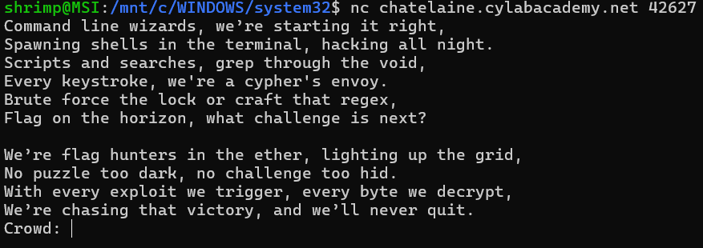
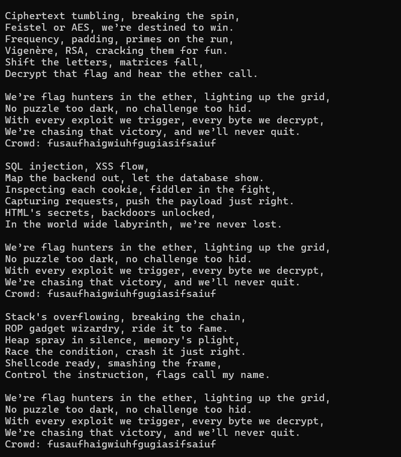

# Mission 
### Find the flag with the format of academy{...}

# File setup 

### Cylab will provide us 1 file(source code) and a netcat connect to run the code.

# Analysis

First, I launch instance and run the netcat connect to see how the program run. I see a lot of text running through the screen.

 

After a long paragraph of some poem, we can see a line `Crowd: ` demand us to enter some text. I have no idea what to enter so I slam my face at the keyboard. After that we will have more of the poem we see at the beginning 
and the text we enter in `Crowd: ` will repeat until the end of program. 




To have more clearer view of what happen, I open the source code and read it. 
Noticed that at the begin of source code, it open `flag.txt`, meaning that the code itself contain the flag.
Read more of the code, I noticed that its have a secret intro that contain the flag, meaning that we have to access to that intro to pull out the flag. 

```bash 
# Read in flag from file
flag = open('flag.txt', 'r').read()

secret_intro = \
'''Pico warriors rising, puzzles laid bare,
Solving each challenge with precision and flair.
With unity and skill, flags we deliver,
The ether’s ours to conquer, '''\
+ flag + '\n'
```

After that we have a bunch of text of the poem, too long I didn't read a word from it. 

```bash

song_flag_hunters = secret_intro +\

[REFRAIN]
We’re flag hunters in the ether, lighting up the grid,
No puzzle too dark, no challenge too hid.
With every exploit we trigger, every byte we decrypt,
We’re chasing that victory, and we’ll never quit.
CROWD (Singalong here!);
RETURN

[VERSE1]
Command line wizards, we’re starting it right,
Spawning shells in the terminal, hacking all night.
Scripts and searches, grep through the void,
Every keystroke, we're a cypher's envoy.
Brute force the lock or craft that regex,
Flag on the horizon, what challenge is next?

REFRAIN;

Echoes in memory, packets in trace,
Digging through the remnants to uncover with haste.
Hex and headers, carving out clues,
Resurrect the hidden, it's forensics we choose.
Disk dumps and packet dumps, follow the trail,
Buried deep in the noise, but we will prevail.

REFRAIN;

Binary sorcerers, let’s tear it apart,
Disassemble the code to reveal the dark heart.
From opcode to logic, tracing each line,
Emulate and break it, this key will be mine.
Debugging the maze, and I see through the deceit,
Patch it up right, and watch the lock release.

REFRAIN;

Ciphertext tumbling, breaking the spin,
Feistel or AES, we’re destined to win.
Frequency, padding, primes on the run,
Vigenère, RSA, cracking them for fun.
Shift the letters, matrices fall,
Decrypt that flag and hear the ether call.

REFRAIN;

SQL injection, XSS flow,
Map the backend out, let the database show.
Inspecting each cookie, fiddler in the fight,
Capturing requests, push the payload just right.
HTML's secrets, backdoors unlocked,
In the world wide labyrinth, we’re never lost.

REFRAIN;

Stack's overflowing, breaking the chain,
ROP gadget wizardry, ride it to fame.
Heap spray in silence, memory's plight,
Race the condition, crash it just right.
Shellcode ready, smashing the frame,
Control the instruction, flags call my name.

REFRAIN;

END;
```

The code continue with 3 parts:

`Setup`

```bash 
  MAX_LINES = 100
  lip = 0
  start = 0
  refrain = 0
  refrain_return = 0
  finished = False
```

`Get the lyrics, find startLabel, refrain and refrain return` 

```bash 
 song_lines = song.splitlines() 
 
  for i in range(0, len(song_lines)):
    if song_lines[i] == startLabel:
      start = i + 1
    elif song_lines[i] == '[REFRAIN]':
      refrain = i + 1
    elif song_lines[i] == 'RETURN':
      refrain_return = i
```

`Print lyrics` 

```bash 
  line_count = 0
  lip = start
  while not finished and line_count < MAX_LINES:
    line_count += 1
    for line in song_lines[lip].split(';'):
      if line == '' and song_lines[lip] != '':
        continue
      if line == 'REFRAIN':
        song_lines[refrain_return] = 'RETURN ' + str(lip + 1)
        lip = refrain
      elif re.match(r"CROWD.*", line):
        crowd = input('Crowd: ')
        song_lines[lip] = 'Crowd: ' + crowd
        lip += 1
      elif re.match(r"RETURN [0-9]+", line):
        lip = int(line.split()[1])
      elif line == 'END':
        finished = True
      else:
        print(line, flush=True)
        time.sleep(0.5)
        lip += 1
```

Main part
```bash
  reader(song_flag_hunters, '[VERSE1]')
```

The `print lyrics` part really reveal the secret after program. The program will run as follow:

(Cause `reader` function run with [VERSE1] so the secret intro will be skip)

`[VERSE 1] Command line wizards...`

-> `[REFRAIN] line lead into first part `

-> `We're flag hunters... Crowd: (something)...RETURN`

-> `The RETURN part will make program RETURN to the next verse and run it, eg. RETURN 1 return to the second(song_lines start from 0) line of song line and continue to run it`

-> `............continue until END part`

There are some line of code we need to noticed 
```bash 
  for line in song_lines[lip].split(';'):
  .
  .
  .
  elif re.match(r"CROWD.*", line):
        crowd = input('Crowd: ')
        song_lines[lip] = 'Crowd: ' + crowd
```
The 3 lines below mean that if program see the format `Crowd: something` it will run the block of code inside it. The important part here is the `song_lines[lip].split(';')`
meaning that when program run into a ';' in `song_lines` it will split and `for function` will eventually process each part independently. So when it run into `CROWD: (something)`, if I enter `shrimp;mikudayo`, the saved line become `Crowd: shrimp;mikudayo`, and when it run to `Crowd part` again, the program will split `Crowd: shrimp;mikudayo` into 2 parts `Crowd: shrimp`, `mikudayo`, the program then process each part as different lines.

What we also need to notice are these 2 lines

```python
elif re.match(r"RETURN [0-9]+", line):
        lip = int(line.split()[1])
```
These 2 lines mean that what satisfy the format `RETURN + a number(basically a string formed only by number from 0-9)` will run block of code inside it,
which is set `lip = 'number after RETURN'`

Noticed that `lip` is an index to point at each line of `song_lines`. When `lip = 1` it will run second line, I wonder what `lip = 0` will do?

I test it and when `lip = 0` program print first line of `song_lines` which is the `secret_intro` and reveal the flag !!!!!!!

# Solution 

Run the netcat connect in WSL or linux terminal

When the terminal demand input, enter `shrimp;RETURN 0`

Let the program run 

After a long text, the flag will appear !!!

```bash 
Pico warriors rising, puzzles laid bare,
Solving each challenge with precision and flair.
With unity and skill, flags we deliver,
The ether’s ours to conquer, academy{70637h3r_f0r3v3r_577e16ad}
```

FLAGGGGGGGGGGGGG
```text
academy{70637h3r_f0r3v3r_577e16ad}
```
